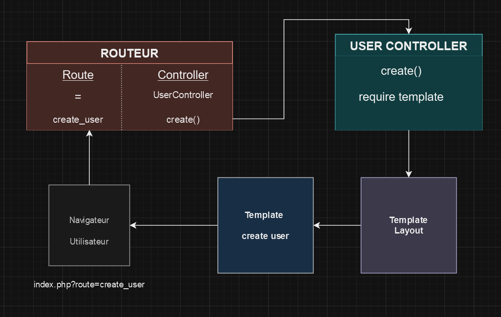

# Le crud contre-attaque!

## Le but de l’exercice

Dans l’exercice précédent, vous avez appris un des fondamentaux de l’implémentation du MVC : la gestion du routing. Mais comme vous avez pu le constater, cela ne concerne que deux des trois lettres du MVC. Vous avez utilisé des Controllers et des Templates : le V et le C donc. Dans cet exercice, nous allons rajouter le M : les Models et Managers et la gestion de la base de données.

## Les modalités

Sur cet exercice, vous allez devoir progresser étape par étape et m’envoyer un message à chaque fin d’étape pour que je vérifier votre code et vous donne s’il est bon la suite des consignes.

Ne partagez pas les consignes avec quelqu’un qui n’est pas à la même étape que vous. Vous pouvez aider vos camarades qui sont à la même étape que vous ou à une étape précédente, mais chacun et chacune doit être capable de comprendre le code qu’iel me présente.

Cet exercice doit me permettre de jauger individuellement pour chacun et chacune d’entre-vous les différents blocages à la fois techniques, de déduction, organisation des fichiers (etc, etc) avant de lancer le projet de groupe.

Merci de jouer le jeu 😊

## Vos repository

Pour ce projet, merci de rendre vos repository publics, et de faire à minima un add/commit/push à la fin de chaque étape.

## CRUD en MVC

Les contenus du cours [BRE03 Web Dev Course](https://kornog-dev.github.io/BRE03/) © 2024 par [Mari Doucet](https://github.com/kornog-dev) sont sous licence [CC BY-NC-SA 4.0](https://creativecommons.org/licenses/by-nc-sa/4.0/?ref=chooser-v1)

## Étape 1 : Mise en place du Routeur

Vous allez utiliser ce que vous avez appris dans l'exercice précédent pour mettre en place un routeur. Voici la liste des routes et des méthodes correspondantes :

- `index.php?route=show_user` -> la méthode `show()` du `UserController`
- `index.php?route=create_user` -> la méthode `create()` du `UserController`
- `index.php?route=check_create_user` -> la méthode `checkCreate()` du `UserController`
- `index.php?route=update_user` -> la méthode `update()` du `UserController`
- `index.php?route=check_update_user` -> la méthode `checkUpdate()` du `UserController`
- `index.php?route=delete_user` -> la méthode `delete()` du `UserController`
- Dans tous les autres cas : la méthode `list()` du `UserController`

Pour le moment, vous n'avez pas de controller, du coup dans les accolades de vos conditions, notez simplement en commentaire le nom de controller et de la méthode qui devra être appelée.

En observant la liste des templates que vous avez dû créer à l'étape 0 et en la comparant avec la liste des méthodes du `UserController` mentionnées ci-dessus, déduisez quelle méthode devra afficher quel template.

```js
// La méthode list() devra afficher le template "list.phtml"
// La méthode create() devra afficher le template "create.phtml"
// La méthode show() devra afficher le template "show.phtml"
// La méthode update() devra afficher le template "update.phtml"
```

Préremplissez vos templates avec le strict minimum, la structure de base d'une page pour le layout avec le require du template contenu dans la variable `$route` et un titre décrivant le nom de la page pour les autres. Inspirez-vous des consignes de l'exercice sur le Routeur.

> 💡 N'oubliez pas de require le fichier `config/Router.php` dans votre fichier `config/autoload.php`

Il y a plus de templates que de méthodes, que pouvez-vous en déduire ? Répondez-moi dans un message sur Discord.

```js
//Les méthodes checkCreate() et checkUpdate() ne servent pas afficher les template mais contiennent la logique nécessaire
// à vérifier les données envoyées par le formulaire que ce soit pour la création d'un user ou un udpate d'un user.

//La méthode delete() servira de logique pour supprimer un user.
```

## Étape 2

Grâce aux déductions de l'étape précédente, vous allez pouvoir mettre en place le squelette de votre `UserController`, créez donc la classe et ses méthodes. Pour les méthodes dont vous avez déduit ce qu'elles doivent afficher, préparez la variable `$route` et faites un `require` du layout.

Une fois que c'est fait, vérifiez que vos routes affichent bien le bon template. Comment pourriez-vous vous simplifier ces tests ?

```js
//Pour tester les routes, on peut rentrer chaque url dans le navigateur.
//exemple :http://127.0.0.1/Crud_en_mvc/index.php?route=create_user
//et un url qui n'existe pas, pour vérifier que le template list est bien appelé dans tous les autres cas
//exemple : 127.0.0.1/Crud_en_mvc/index.php?route=blablabla

//ou intialiser la variable $route avec les valeurs qu'on veut tester dans layout.phtml'
//ou mettre les liens dans une navbar
```

> 💡 N'oubliez pas de require le fichier `controllers/UserController.php` dans votre fichier `config/autoload.php`

## Étape 3

Dans cette étape, je vais vous demander d'utiliser le logiciel de votre choix (canva, Google Draw, MS Paint ...) pour créer un schéma de ce qui se passe lorsque vous appelez l'URL `index.php?route=create_user`. Vous pouvez vous inspirer du schéma de fonctionnement du MVC présent dans le cours.



## Étape 4

Nous avons maintenant un squelette de Controller et un schéma du fonctionnement de la route `create_user`, nous allons donc tenter d'aller plus loin dans la mise en place de cette route.

Nous allons commencer par créer le modèle qui permet de représenter la table `users` de notre base de données.

Dans le fichier `models/User.php` créez une classe `User` qui correspond à la table `users` de votre base de données.

> 💡 N'oubliez pas de require le fichier `models/User.php` dans votre fichier `config/autoload.php`

## Étape 5

Dans cette étape, nous allons gérer la connexion à votre base de données.

Dans le fichier `managers/AbstractManager.php`, vous allez créer une classe abstraite `AbstractManager`, elle n'a qu'un seul attribut `protected`, appelé `$db`, qui est une instance de la classe `PDO` (fournie par PHP, rien à require).

Le constructeur de la classe ne prend pas de paramètres, par contre, il initialise son attribut `$db` avec les informations de connexion à votre base de données.

> 💡 N'oubliez pas de require le fichier `managers/AbstractManager.php` dans votre fichier `config/autoload.php`

## Étape 6

Dans cette étape, nous allons gérer les interactions avec votre base de données. Vous pouvez vous inspirer des différents exercices réalisés pendant le module POO (userbase en POO, blog en POO) et de ce que vous aviez appris avec Hugues sur les requêtes avec PDO (https://discord.com/channels/1092386966760329229/1290243753428123683/1326470557121904641).

Dans le fichier `managers/UserManager.php`, créez une classe `UserManager` qui hérite de la classe `AbstractManager`.

Elle n'a pas d'attributs et son constructeur ne fait rien à part appeler le constructeur de sa classe parente.

Elle contient par contre les méthodes publiques nécessaires pour un Manager (https://kornog-dev.github.io/BRE03/php/mvc/#les-managers).

Implémentez ces méthodes en adaptant la situation à la classe `User` et à la table `users` de votre base de données.

> 💡 N'oubliez pas de require le fichier `managers/UserManager.php` dans votre fichier `config/autoload.php`

Une fois que cette étape est terminée, envoyez-moi un message sur Discord pour obtenir la suite des consignes.
